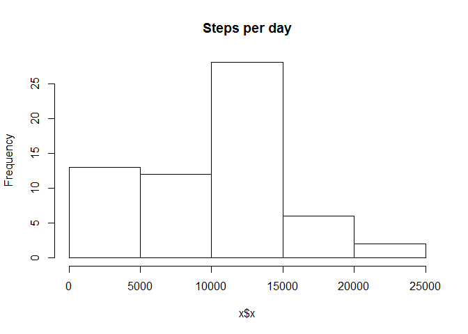
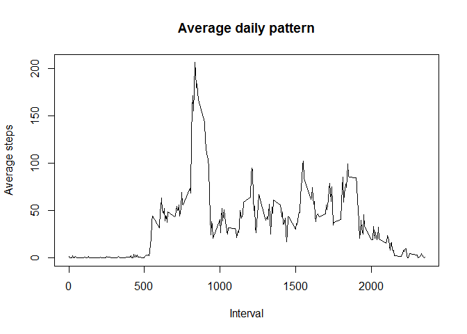

# Reproducible Research: Peer Assessment 1


## Loading and preprocessing the data
We unzip and load the data using the next function:


```r
data <- read.csv(unz("activity.zip", "activity.csv"))
```

The next thing we will do is transform the date into a date format:


```r
data$date <- as.Date(data$date, "%Y-%m-%d")
```

## What is mean total number of steps taken per day?

Let's create a data.frame with the steps taking each day. We will remove the empty values too.


```r
x <- aggregate(data$steps, by=list(Category=data$date), FUN=sum, na.rm=TRUE)
```

Let's plot with an histogram the data:


```r
hist(x$x, main="Steps per day")
```

 

So, the mean of steps per day is:


```r
mean(x$x)
```

```
## [1] 9354.23
```

The median is:

```r
median(x$x)
```

```
## [1] 10395
```

## What is the average daily activity pattern?


```r
new_data <- aggregate(data$steps, by=list(Category=data$interval), FUN=mean, na.rm=TRUE)
plot(new_data$Category, new_data$x, type="l", main="Average daily pattern", xlab="Interval", ylab="Average steps")
```

 


## Imputing missing values


## Are there differences in activity patterns between weekdays and weekends?
